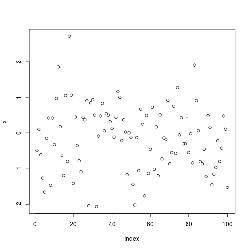
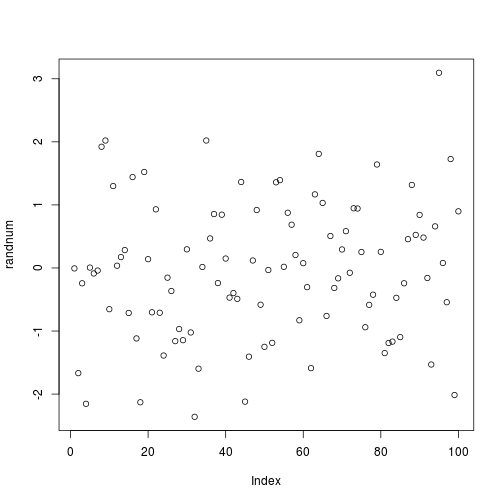
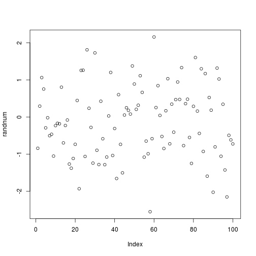
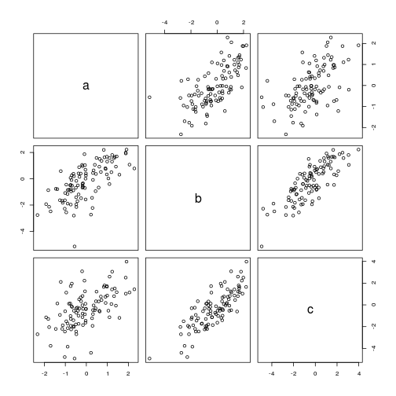
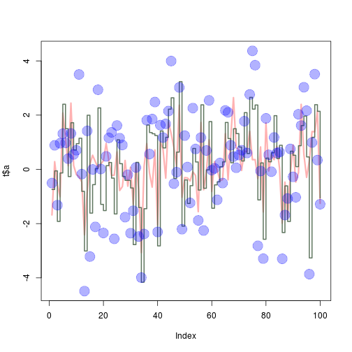
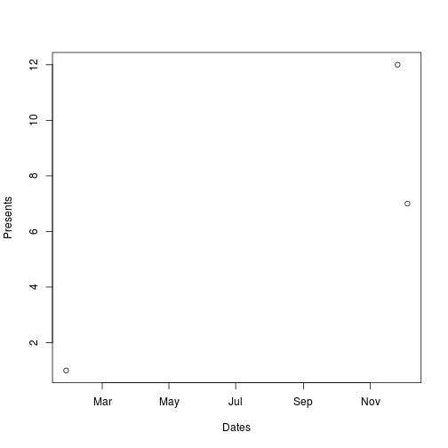

# **Assignment 0: Intro to R and Githhub**
## **Introduction**
**Github Account:** *https://github.com/eaneatfruit*

The following report will document the completed exercises in the document "A (very) short introduction to R", and a published report using R Markdown as well as knitr. The document contains all 15 ToDo exercises. The objective of this assignment is familiarize ourselvevs with R and the usage of git and github. Furthermore, this report in html format will be uploaded to my github.

#### **A (Very) Short Introduction to R**

**1.)** 
Compute the difference between 2016 and the year you  started  at  this  university  and  divide
this by the difference between 2016 and the year
you  were  born.   Multiply  this  with  100  to  get
the  percentage  of  your  life  you  have  spent  at
this university.  Use brackets if you need them. 

```r
((2016-2014)/(2016-1992)) * 100
```

```
## [1] 8.333333
```

**2.)**
Repeat  the  previous  ToDo,  but  with  several
steps  in  between.   You  can  give  the  variables
any name you want, but the name has to start
with a letter.


```r
AcademicLife <- (2016-2014)
TotalLife <- (2016-1992)
LifeSpent <- ((AcademicLife/TotalLife) * 100)
LifeSpent
```

```
## [1] 8.333333
```

**3.)**
Compute the sum of 4, 5, 8 and 11 by first combining  them  into  a vector  and  then  using  the function **sum**.

```r
vector <- c(4, 5, 8, 11)
sum(vector)
```

```
## [1] 28
```

**4.)**
Plot 100 normal random numbers.

```r
x = rnorm(100)
plot(x)
```



**5.)**
Find help for the sqrt function. The sqrt() function is a mathematical function that computes the absolute value of x in an example like such as sqrt(x).

```r
help(sqrt)
```

**6.)**
Make a file called firstscript.R containing R-code  that  generates 100  random  numbers  and plots them, and run this script several times.


```r
source("/home/malin4/SRT411/firstscript.R")
```



*Contents of firstscript.R:*

```r
randnum <- rnorm(100)
plot(randnum)
```



**7.)**
Put  the  numbers  31  to  60  in  a  vector  named
P and in a matrix with 6 rows and 5 columns named Q. **Tip:**  
use the function seq.  Look at the different ways scalars, vectors and matrices are denoted in the workspace window.


```r
Q <- matrix(P <- c(31:60), nrow = 6, ncol = 5)
Q
```

```
##      [,1] [,2] [,3] [,4] [,5]
## [1,]   31   37   43   49   55
## [2,]   32   38   44   50   56
## [3,]   33   39   45   51   57
## [4,]   34   40   46   52   58
## [5,]   35   41   47   53   59
## [6,]   36   42   48   54   60
```

```r
seq(Q)
```

```
##  [1]  1  2  3  4  5  6  7  8  9 10 11 12 13 14 15 16 17 18 19 20 21 22 23
## [24] 24 25 26 27 28 29 30
```

**8.)**
Make  a  script  file  which  constructs  three  random  normal  vectors  of  length  100.   Call  these vectors x1, x2 and x3. Make a data frame called **t** with three columns (called a, b and c) containing  respectivelyx1, x1+x2 and x1+x2+x3. Call the following functions for this data frame: plot(t) and sd(t). Can you understand the results?  Rerun this script a few times.

Calling the Script

```r
#source("/home/malin4/SRT411/VectorScript.R")
```

Note that the standard deviation function does not work because it is no longer existing since R-3.0.0. Advised to use sapply(x, sd) instead. Also, the standard deviation function does not work with data frames.  *Content of the Script:*

```r
x1 <- c(rnorm(100))
x2 <- c(rnorm(100))
x3 <- c(rnorm(100))

t = data.frame(a = x1, b = x1+x2, c = x1+x2+x3)
plot(t)
```



```r
sd(x1)
```

```
## [1] 0.9760957
```

```r
sd(x2)
```

```
## [1] 1.047197
```

```r
sd(x3)
```

```
## [1] 0.9985819
```

**9.)**
Add these lines to the script file of the previous
section.  Try to find out, either by experiment-
ing or by using the help, what the meaning is of
rgb, the last argument of rgb, lwd, pch, cex.

*Content of Script:*

```r
x1 <- c(rnorm(100))
x2 <- c(rnorm(100))
x3 <- c(rnorm(100))

t = data.frame(a = x1, b = x1+x2, c = x1+x2+x3)

plot(t$a, type="l", ylim=range(t),
lwd=3, col=rgb(1,0,0,0.3))
lines(t$b, type="s", lwd=2,
col=rgb(0.3,0.4,0.3,0.9))
points(t$c, pch=20, cex=4,
col=rgb(0,0,1,0.3))
```



*Explanation:*
The meaning of **rgb** is the *Red, Green, Blue Color Specification.* The last parameter of the rgb function is the alpha parameter. The alpha parameter is the optional argument for transparency.

The option **lwd** is the line width for drawing symbols.

The option **pch** is to add points to a plot. It draws a sequence of points based on the x and y coordinates.

The option **cex** are for character or symbol expansions.

**10.)**
Make  a  file  called **tst1.txt** in  Notepad  from
the  example  in  *Figure  4*  and  store  it  in  your
working directory.  Write a script to read it, to multiply the column called g by 5 and to store it as **tst2.txt**.


```r
d = data.frame(a = c(1,2,4,8,16,32), g = c(2, 4,8,16,32,64), x = c(3,6,12,24,48,96))
write.table(d, file = "tst1.txt", row.names = FALSE)
source("/home/malin4/SRT411/readfile.R")
```

*Contents of readfile.R:*

```r
d = read.table(file="tst1.txt", header = TRUE)
d$g <- d$g * 5
d = write.table(d, file = "tst2.txt", row.names = FALSE)
```

**11.)**
Compute the mean of the square root of a vector  of  100  random  numbers.   What  happens?

*Explanation: Some values of the vectors were returned, however, many NaN values were produced. NaNs are an abbreviation for 'Not a Number.'*


```r
x <- c(rnorm(100))
sqx <- sqrt(x)
```

```
## Warning in sqrt(x): NaNs produced
```

```r
y <- mean(sqx, na.rm = TRUE)
y
```

```
## [1] 0.8223149
```

**12.)**
Make  a  graph  with  on  the  x-axis:  today,  Sinterklaas  2016  and  your  next  birthday  and  on
the y-axis the amount of presents you expect on
each of these days.  Tip:  make two vectors first.


```r
date=strptime(c("20160128","20161205", "20161126"), format="%Y%m%d")
presents_num=c(1, 7, 12)
plot(date, presents_num, xlab = "Dates", ylab = "Presents")
```



**13.)**
Make a vector from 1 to 100.  Make a for-loop
which runs through the whole vector.  Multiply
the elements which are smaller than 5 and larger
than 90 with 10 and the other elements with 0.1


```r
vector = c(1:100)
x = c()
for (i in 1:length(vector))
  {
    if (vector[i] < 5)
      {
        x[i] <- (vector[i]*10)
      }
    else if (vector[i] > 90)
      {
        x[i] <- (vector[i]*10)
      }
    else
      {
        x[i] <- (vector[i]*0.1)
      }
  }
x
```

```
##   [1]   10.0   20.0   30.0   40.0    0.5    0.6    0.7    0.8    0.9    1.0
##  [11]    1.1    1.2    1.3    1.4    1.5    1.6    1.7    1.8    1.9    2.0
##  [21]    2.1    2.2    2.3    2.4    2.5    2.6    2.7    2.8    2.9    3.0
##  [31]    3.1    3.2    3.3    3.4    3.5    3.6    3.7    3.8    3.9    4.0
##  [41]    4.1    4.2    4.3    4.4    4.5    4.6    4.7    4.8    4.9    5.0
##  [51]    5.1    5.2    5.3    5.4    5.5    5.6    5.7    5.8    5.9    6.0
##  [61]    6.1    6.2    6.3    6.4    6.5    6.6    6.7    6.8    6.9    7.0
##  [71]    7.1    7.2    7.3    7.4    7.5    7.6    7.7    7.8    7.9    8.0
##  [81]    8.1    8.2    8.3    8.4    8.5    8.6    8.7    8.8    8.9    9.0
##  [91]  910.0  920.0  930.0  940.0  950.0  960.0  970.0  980.0  990.0 1000.0
```

**14.)**
Write  a  function  for  the  previous  ToDo,  so
that   you   can   feed   it   any   vector   you   like
(as  argument).     Use  the  standard  R  function **length** in the specification of the counter.

```r
vec <- c(50:150)

func1 <- function(arg1)
  {
  y <- c()
  for (i in 1:length(arg1))
    {
      if (arg1[i] < 5)
      {
        y[i] <- (arg1[i]*10)
      }
      else if (arg1[i] > 90)
      {
        y[i] <- (arg1[i]*10)
      }
      else
      {
        y[i] <- (arg1[i]*0.1)
      }
    }
  return(y)
  }
func1(arg1 <- vec)
```

```
##   [1]    5.0    5.1    5.2    5.3    5.4    5.5    5.6    5.7    5.8    5.9
##  [11]    6.0    6.1    6.2    6.3    6.4    6.5    6.6    6.7    6.8    6.9
##  [21]    7.0    7.1    7.2    7.3    7.4    7.5    7.6    7.7    7.8    7.9
##  [31]    8.0    8.1    8.2    8.3    8.4    8.5    8.6    8.7    8.8    8.9
##  [41]    9.0  910.0  920.0  930.0  940.0  950.0  960.0  970.0  980.0  990.0
##  [51] 1000.0 1010.0 1020.0 1030.0 1040.0 1050.0 1060.0 1070.0 1080.0 1090.0
##  [61] 1100.0 1110.0 1120.0 1130.0 1140.0 1150.0 1160.0 1170.0 1180.0 1190.0
##  [71] 1200.0 1210.0 1220.0 1230.0 1240.0 1250.0 1260.0 1270.0 1280.0 1290.0
##  [81] 1300.0 1310.0 1320.0 1330.0 1340.0 1350.0 1360.0 1370.0 1380.0 1390.0
##  [91] 1400.0 1410.0 1420.0 1430.0 1440.0 1450.0 1460.0 1470.0 1480.0 1490.0
## [101] 1500.0
```


**15.)**
Actually,  people  often  use  more  for-loops  than  necessary. The  ToDo  above  can  be  done  more  easily
and quickly without a for-loop but with regular vector computations.


```r
vector <- c(1:100)
ifelse(vector < 5 | vector > 90, vector * 10, vector * 0.1)
```

```
##   [1]   10.0   20.0   30.0   40.0    0.5    0.6    0.7    0.8    0.9    1.0
##  [11]    1.1    1.2    1.3    1.4    1.5    1.6    1.7    1.8    1.9    2.0
##  [21]    2.1    2.2    2.3    2.4    2.5    2.6    2.7    2.8    2.9    3.0
##  [31]    3.1    3.2    3.3    3.4    3.5    3.6    3.7    3.8    3.9    4.0
##  [41]    4.1    4.2    4.3    4.4    4.5    4.6    4.7    4.8    4.9    5.0
##  [51]    5.1    5.2    5.3    5.4    5.5    5.6    5.7    5.8    5.9    6.0
##  [61]    6.1    6.2    6.3    6.4    6.5    6.6    6.7    6.8    6.9    7.0
##  [71]    7.1    7.2    7.3    7.4    7.5    7.6    7.7    7.8    7.9    8.0
##  [81]    8.1    8.2    8.3    8.4    8.5    8.6    8.7    8.8    8.9    9.0
##  [91]  910.0  920.0  930.0  940.0  950.0  960.0  970.0  980.0  990.0 1000.0
```

*ifelse() Explanation:* This is basically saying if vector is less than 5 and vector is greater than 90, then the selected vectors are multiplied by 10. Everything else is multiplied by 0.1. Simply put: **Ifelse(if condition, if true do, else do)**

#### **Acknowledgements**
* https://cran.r-project.org/doc/contrib/Torfs+Brauer-Short-R-Intro.pdf
* https://www.rstudio.com/wp-content/uploads/2015/02/rmarkdown-cheatsheet.pdf
* http://rmarkdown.rstudio.com/
* http://nicercode.github.io/guides/reports/
* http://kbroman.org/knitr_knutshell/pages/markdown.html
* http://kbroman.org/knitr_knutshell/pages/Rmarkdown.html
* http://stackoverflow.com/questions/15103465/how-to-multiply-a-single-column-in-a-data-frame-by-a-number
* http://www.lynda.com/R-tutorials/Up-Running-R/120612-2.html
